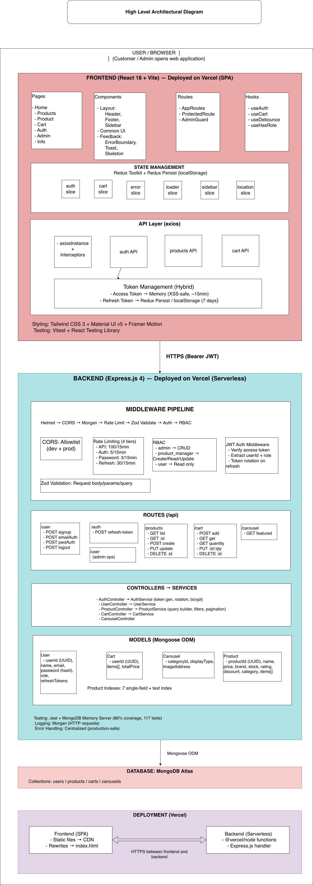

# 🛍️ E-commerce Backend API

> RESTful API powering an Amazon-inspired e-commerce platform — built with production patterns in mind.

[](https://github.com/404notDeeksha/Ecommerce-App-Backend/blob/main/License) · [](https://nodejs.org) · [](https://expressjs.com) · [](https://www.mongodb.com/atlas) · [](https://vercel.com) · [](https://github.com/404notDeeksha/Ecommerce-App-Backend)

**[🌐 Live Demo](https://ecommerce-app-techwithdeekksha.vercel.app)** · **[Frontend Repo](https://github.com/404notDeeksha/Ecommerce-App)**

---

## 🏗️ Architecture



---

## 🎯 Key Highlights

- **JWT Auth** — Dual-token system (access 15m + refresh 7d) with rotation & DB storage
- **Layered Rate Limiting** — Global (100/15m), auth (5/15m), password brute-force (3/15m), refresh (30/15m)
- **RBAC** — Permission-based access: admin, product_manager, user
- **MongoDB Indexing** — 8 indexes (1 text + 7 single-field) for filtered product queries
- **Zod Validation** — Schema-based request validation with type coercion
- **86% Test Coverage** — 117 tests with MongoDB Memory Server; services & core middleware at 100%
- **Serverless-Ready** — Vercel-compatible Express setup

## ⚙️ Tech Stack

| Layer | Technology |
|-------|------------|
| Runtime | Node.js 18+ · Express.js |
| Database | MongoDB Atlas + Mongoose |
| Auth | JWT (rotation + refresh tokens in DB) |
| Validation | Zod |
| Security | Helmet, CORS, bcryptjs, 4-layer rate limiting |
| Testing | Jest + MongoDB Memory Server |
| Deployment | Vercel (serverless) |

## 📡 API Surface

| Route | Methods | Auth |
|-------|---------|------|
| `/api/user` | POST signup, emailAuth, passwordAuth, logout | — |
| `/api/auth/refresh-token` | POST | — |
| `/api/products` | GET list (+ filters), POST create | create* |
| `/api/products/product/:id` | GET | — |
| `/api/products/:id` | PUT update*, DELETE delete* | update* / delete* |
| `/api/cart` | POST, GET, PUT, DELETE | JWT |
| `/api/cart/quantity` | GET | JWT |
| `/api/carousel/featured` | GET | — |

### Product Filters
`?search=` · `?category=` · `?subCategory=` · `?minPrice=` · `?maxPrice=` · `?brand=` · `?discount=` · `?rating=` · `?sortBy=` · `?page=` · `?limit=`

### RBAC Roles
| Role | Permissions |
|------|-------------|
| `admin` | create, read, update, delete |
| `product_manager` | create, read, update |
| `user` | read only |

## 🧠 Engineering Decisions

- **Token rotation** — old refresh token invalidated on each `/refresh-token` call
- **Auto-priced carts** — `pre("save")` hook recalculates `totalPrice` from items
- **Fail-fast config** — missing env vars crash at startup via `envValidator.js`
- **Password safety** — `select: false` by default; explicit `.select("+password")` only for auth
- **Cart quantity aggregation** — MongoDB `$unwind` + `$group` avoids loading full cart
- **CORS for Vercel previews** — regex allowlist for `*.vercel.app` preview URLs
- **Async error handling** — `asyncHandler` wrapper forwards rejections to centralized error middleware
- **Query builder pattern** — dynamic MongoDB query construction from optional filters

## 📊 Metrics

| Metric | Value | Verify |
|--------|-------|--------|
| Test coverage | 86% (117 tests) | `npm run test:coverage` |
| Service layer | 100% | Coverage report |
| Auth/RBAC middleware | 100% | Coverage report |
| Rate limiter layers | 4 | `config/rateLimit.js` |
| MongoDB indexes | 8 | `Products.model.js` |

**Query perf check:**
```js
db.products.find({ category: "Electronics" }).explain("executionStats")
// totalKeysExamined ≈ totalDocsExamined = index hit (no COLLSCAN)
```

## API Performance

Endpoint Tested:
GET /api/products

Benchmark Tool: Autocannon

Load Profile:
50 Concurrent Users
20 Second Duration
<details>
<summary><strong>📁 Project Structure</strong></summary>

```
├── config/          envValidator, jwt, rateLimit, dbConnection, corsOptions
├── controllers/     User, Products, Cart, Carousel
├── services/        auth (token gen/rotate), user, products (query builder), cart
├── middlewares/     auth, rbac, errorHandler, validateRequest, requestLogger
├── models/          User (refreshTokens), Products (8 indexes), Cart (pre-save hook), Carousel
├── validations/     Zod schemas (user, products, cart)
├── routes/          Express route definitions
├── utils/           asyncHandler, isAllowedOrigin
├── tests/           11 test files, 117 tests (setup.js, testEnv.js)
└── main.js          Entry point (dev server + Vercel export)
```
</details>

<details>
<summary><strong>🚀 Setup</strong></summary>

```bash
git clone git@github.com:404notDeeksha/Ecommerce-App-Backend.git
cd Ecommerce-App-Backend && npm install
cp .env.example .env   # Edit MONGODB_URL + JWT secrets
npm run dev
```

**Env variables:** `PORT`, `MONGODB_URL`, `DEP_FRONTEND_URL`, `DEV_FRONTEND_URL`, `ACCESS_TOKEN_SECRET`, `REFRESH_TOKEN_SECRET`, `ACCESS_TOKEN_EXPIRY`, `REFRESH_TOKEN_EXPIRY`, `RATE_LIMIT_WINDOW_MS`, `RATE_LIMIT_MAX_REQUESTS`, `AUTH_RATE_LIMIT_MAX`

**Tests** (uses in-memory MongoDB, no external DB needed):
```bash
npm test              # 117 tests
npm run test:coverage # 86% coverage report
```

**Response format:**
```json
// Success
{ "success": true, "message": "...", "data": {...}, "pagination": { "total": 100, "page": 1, "totalPages": 5 } }
// Error
{ "success": false, "message": "...", "code": "TOKEN_EXPIRED" }
```
</details>

## 📈 Roadmap

- [x] JWT auth + token rotation
- [x] MongoDB indexing + query builder
- [x] Layered rate limiting + RBAC
- [x] Test coverage (86%)
- [ ] Order management · Stripe payments · Reviews · Wishlist · Redis caching

---

ISC — [LICENSE](https://github.com/404notDeeksha/Ecommerce-App-Backend/blob/main/License)
